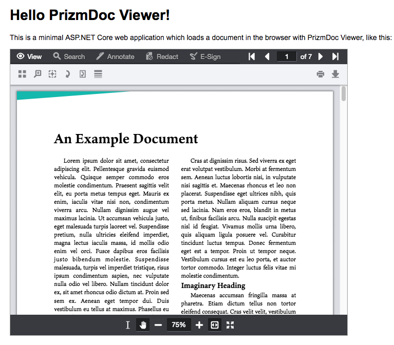

# Hello PrizmDoc Viewer with ASP.NET Core and HTML

A minimal ASP.NET Core web application which integrates PrizmDoc Viewer.

## Pre-Requisites

### For the Command Line

- [.NET Core SDK 3.1](https://dotnet.microsoft.com/download/dotnet-core/3.1)

### For Visual Studio

- [Visual Studio 2019](https://visualstudio.microsoft.com/downloads/)

### For Visual Studio Code

- [.NET Core SDK 3.1](https://dotnet.microsoft.com/download/dotnet-core/3.1)
- [Visual Studio Code](https://code.visualstudio.com/download)
- [C# for Visual Studio Code extension](https://marketplace.visualstudio.com/items?itemName=ms-vscode.csharp) (if you don't have this extension installed, running the sample will fail with an error dialog that says "Configured type 'coreclr' is not supported.")

## Setup

### Configure the Application to Connect to PAS

Configure how to connect to PAS (PrizmDoc Application Services) by editing `MyWebApplication/appsettings.json` (or via any of the other ways that ASP.NET Core allows you to provide configuration).

#### Use PrizmDoc Cloud (Easiest)

If you're just getting started, the easiest thing to do is to use [PrizmDoc Cloud]. We host PAS for you and all you need is your [PrizmDoc Cloud](https://cloud.accusoft.com) API key. If you don't have an API key, you can get one for free at https://cloud.accusoft.com.

For [PrizmDoc Cloud], your `appsettings.json` will need to contain a section like this:

```json
  "PrizmDoc": {
    "PasBaseUrl": "https://api.accusoft.com/prizmdoc/",
    "CloudApiKey": "YOUR_API_KEY"
  }
```

Where `YOUR_API_KEY` is your [PrizmDoc Cloud](https://cloud.accusoft.com) API key.

> Note: If you'd rather not store your API key within `appsettings.json`, the `MyWebApplication` project has been pre-configured for use with the `dotnet user-secrets` command-line tool. You can use this tool to configure a `"PrizmDoc:CloudApiKey"` value for just your dev machine like so:

```
dotnet user-secrets set "PrizmDoc:CloudApiKey" "YOUR_API_KEY" --project MyWebApplication
```

#### Host PAS Yourself (Advanced)

If you are self-hosting your own PAS instance, your `appsettings.json` will be configured slightly differently:

```json
  "PrizmDoc": {
    "PasBaseUrl": "YOUR_PAS_BASE_URL",
    "PasSecretKey": "YOUR_PAS_SECRET_KEY"
  }
```

The `PasBaseUrl` should be the base URL for requests to your PAS instance (like `"http://localhost:3000/"`).

The `PasSecretKey` must match the `secretKey` value specified in your PAS config file.

> Note: If you'd rather not store your secret key within `appsettings.json`, the `MyWebApplication` project has been pre-configured for use with the `dotnet user-secrets` command-line tool. You can use this tool to configure a `"PrizmDoc:PasSecretKey"` value for just your dev machine like so:

```
dotnet user-secrets set "PrizmDoc:PasSecretKey" "YOUR_PAS_SECRET_KEY" --project MyWebApplication
```

## Running the Sample

To start the application from the command line:

```
dotnet run --project MyWebApplication
```

This will launch a small web application on `http://localhost:5000`.

If you have configured your connection to PAS correctly, you should see output like this:

```
info: Microsoft.AspNetCore.DataProtection.KeyManagement.XmlKeyManager[0]
      User profile is available. Using 'C:\Users\jdoe\AppData\Local\ASP.NET\DataProtection-Keys' as key repository and Windows DPAPI to encrypt keys at rest.
Hosting environment: Development
Content root path: C:\Users\jdoe\source\hello-prizmdoc-viewer-with-dotnet-and-html\MyWebApplication
Now listening on: http://localhost:5000
Application started. Press Ctrl+C to shut down.
```

When you visit `http://localhost:5000`, you should see a viewer with an example document, like this:




[PrizmDoc Cloud]: https://cloud.accusoft.com
